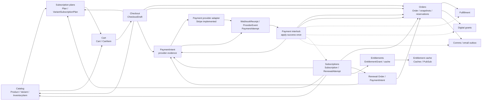

# Store Blueprint Commerce Dependency Map

This is the S0-04 dependency inventory for the subscription-commerce slice, inspected on 2026-08-27. It records executable dependencies found in source, migrations, configuration, tests, and governance documents. The source tree and database migrations are authoritative for current behaviour; governance comparisons are explicitly labelled.

The map covers the path from catalog sellability through cart, checkout, payment, order settlement, subscription activation and renewal, entitlement evaluation, and the directly coupled physical, digital, and communications follow-up. It does not claim that a dependency is desirable or that a target architecture exists.

## 1. Purpose

Dependency mapping makes ownership, data coupling, execution coupling, and failure propagation visible before hardening or extraction work starts. In this repository a domain boundary can be represented by an Ash domain, a facade, a resource, a service, a worker, or a combination of those; the map therefore follows call sites and foreign keys rather than package names alone.

The extraction goal is to identify which parts of the current commerce implementation have a usable boundary and which parts still depend on shared order, payment, catalog, inventory, subscription, entitlement, or infrastructure concerns. The current implementation is not event-driven at the domain boundary: several important boundaries are direct function calls followed by Oban enqueue operations.

The terms used below are:

- **FACT** — directly observed in source, migrations, configuration, or tests.
- **GOVERNANCE COMPARISON** — a documented rule compared with executable behaviour.
- **EXTRACTION IMPLICATION** — a consequence for future separation, not a proposed implementation.

## 2. High Level Dependency Graph

The graph shows the current call direction. Solid arrows represent direct reads or calls. Dashed arrows represent Oban enqueue/worker hand-off. No durable domain-event broker or general event fan-out layer was found in the scoped source.

The duplicate-looking `Payment interlock -> Order` edges are intentional in the current implementation: the payment-success transaction updates the order and consumes its reservations, and the post-commit path separately emits an order-state notification.

### Main orchestration hubs

| Hub | Current responsibility | Evidence | Dependency consequence |
|---|---|---|---|
| `Store.Checkout` | Locks a cart/version, validates catalog and plan data, calls `Store.Orders.begin_checkout/2`, creates or reuses `CheckoutDraft`, writes order snapshots, quotes shipping/tax, finalizes totals, and reserves inventory. | [`lib/store/checkout/domain.ex`](../../lib/store/checkout/domain.ex) | Checkout is a direct coordinator of six domain areas and is not an isolated draft-only component. |
| `Store.Payments.Interlocks` | Normalizes verified receipts, records `ProviderEvent` and `PaymentAttempt`, applies a payment once, marks `PaymentIntent`/`Order`, consumes reservations, and enqueues downstream work. | [`lib/store/payments/interlocks.ex`](../../lib/store/payments/interlocks.ex) | Payment success is the current cross-domain fan-out point. |
| `Store.Subscriptions.Facade` | Creates subscriptions from paid orders, persists stored payment methods, performs renewal orchestration, builds renewal orders, performs off-session charging, reconciles paid renewals, changes plans/variants, cancels/expirs subscriptions, and invokes entitlements/comms. | [`lib/store/subscriptions/facade.ex`](../../lib/store/subscriptions/facade.ex) | Subscription extraction is coupled to order, payment, catalog, pricing, shipping, entitlement, comms, and Oban concerns. |
| `Store.Orders.InventoryReservations` | Locks inventory rows, updates `InventoryItem` counters, creates/updates `InventoryReservation`, consumes/releases/expires reservations, and invalidates catalog availability caches. | [`lib/store/orders/inventory_reservations.ex`](../../lib/store/orders/inventory_reservations.ex) | Inventory is implemented under Orders rather than as a separate domain boundary. |

## 3. Domain Dependency Map

The following table lists the material cross-domain dependencies discovered in the scoped implementation. The data exchanged column describes the values passed or read; it is not a claim that these are stable integration contracts.

| Caller | Callee | Reason for dependency | Data exchanged | Lifecycle impact | Extraction risk |
|---|---|---|---|---|---|
| `Store.Catalog.Facade` | `Store.Subscriptions.Facade` | Catalog reads and eligibility paths filter or validate membership/subscription purchase conditions. | Actor/user id, product/variant/plan ids, membership keys, eligibility result. | Catalog sellability and storefront visibility can depend on subscription-specific rules. | Catalog cannot currently be separated without carrying subscription eligibility knowledge or replacing this call. |
| `Store.Carts.Facade` | `Store.Catalog` resources and `StockFastPath` | Validate product publication, active variant, option completeness, price/currency, and stock precheck before mutation. | Cart item input, variant/product ids, option selection, quantity, current catalog records, available quantity. | Invalid or unavailable catalog data prevents cart addition/update. | Cart is coupled to Catalog resources, inventory read cache, and catalog status semantics. |
| `Store.Carts.Facade` | `Store.Subscriptions.Facade` | Prevent or reject disallowed membership purchase combinations while adding an item. | Cart user id, selected subscription plan id(s), eligibility result. | Subscription plan lines can be rejected before checkout. | Cart imports subscription policy and is not a catalog-agnostic line-item store. |
| `Store.Checkout` | `Store.Carts.Facade` | Load the actor-owned active cart and use its token/version as checkout input. | Actor, bearer cart token, `Cart`, `CartItem`, cart version. | Checkout is bound to one exact cart version. | Checkout depends on cart ownership and version semantics. |
| `Store.Checkout` | `Store.Catalog` and `Store.Subscriptions` resources | Resolve variants, products, option completeness, subscription plans, and variant-plan attachments while creating/finalizing checkout. | Variant/product rows, plan rows, variant-plan rows, plan ids, product kind, price/currency snapshots. | Unpublished/inactive or invalid plan lines stop checkout; plan identity is copied to order evidence. | Checkout directly knows catalog and subscription data shapes. |
| `Store.Checkout` | `Store.Orders` | Begin/reuse order, write price/tax/shipping snapshots, finalize totals, and reserve inventory for the order. | Checkout key, user id, line items, currency, integer minor-unit totals, snapshot maps, order id. | Checkout creates the commercial order before payment and determines the order amount that payment must match. | Order is not behind a narrow checkout port; checkout calls order functions and raw Ecto paths. |
| `Store.Checkout` | `Store.Pricing` and `Store.Shipping` | Evaluate tax/shipping totals and persist quote evidence for non-subscription-only orders. | Typed quote request, tax rates, quote hash/evidence, shipping amount/currency/rule ids, pricing contract version. | Final order totals and payable currency are set. Physical subscription checkout and renewal remain coupled to shipping. | Pricing and shipping schemas/contract versions cross the order and subscription boundaries. |
| `Store.Checkout` | `Store.Repo` | Lock cart, items, and order; create/reuse checkout draft; coordinate transactions and unique-conflict recovery. | `FOR UPDATE` rows, cart/version predicates, draft/order ids, database constraint results. | Provides duplicate-start and stale-cart behaviour. | Transaction ownership is in the orchestration module, making extraction dependent on shared transaction semantics. |
| `Store.Orders.InventoryReservations` | `Store.Catalog.InventoryItem` and `Store.Catalog` caches | Reserve, consume, release, or expire stock associated with an order. | Variant ids, requested quantities, inventory counters/version, reservation rows, affected product ids. | Checkout creates active holds; payment success consumes them; failure/expiry releases them. | The Orders module owns a Catalog inventory counter and cache invalidation; `variant_id` is not a migration FK on reservation rows. |
| `Store.Payments` | `Store.Checkout` and `Store.Digital.Facade` | Build payment context from an actor-owned checkout and require a signed-in actor for digital paid orders. | Checkout key, order id, totals/currency/finalization state, actor id, digital-asset presence. | Only finalized/payable checkout reaches intent creation. | Payment entry depends on checkout representation and digital product policy. |
| `Store.Payments.Interlocks` | `Store.Payments.Providers` | Verify/normalize provider receipts and make checkout or off-session provider calls through the resolver. | Provider atom, raw body/headers, canonical receipt, provider ids, amount/currency, renewal key, provider references. | Provider evidence drives local payment state changes. | Provider contract and local payment lifecycle are concentrated in one interlock path. |
| `Store.Payments.Interlocks` | `PaymentIntent`, `ProviderEvent`, `PaymentAttempt` | Persist receipt-derived evidence and apply canonical success/failure/requires-action outcomes. | Payment intent id, provider event key, event type, payload hashes, outcome, state transition. | Payment evidence and local payment lifecycle advance together, subject to resource identities and transition actions. | There is no separate durable event fan-out boundary between evidence recording and downstream application. |
| `Store.Payments.Interlocks` | `Store.Orders` and `Store.Orders.InventoryReservations` | Apply a successful payment once, mark the order paid, and consume order reservations. | Order/payment ids, `application_key`, order state, payment state, reservation rows. | A verified success produces the paid commercial outcome in one database transaction. | Payment owns the trigger for order and inventory changes. |
| `Store.Payments.Interlocks` | `Store.Fulfillment`, `Store.Digital`, `Store.Subscriptions`, `Store.Comms` | Enqueue post-commit follow-up for physical fulfillment, digital grants, initial/renewal subscription work, and order receipt email. | Order id, renewal attempt id, subscription-only classification, email/order id. | Paid order fans out to operational, access, subscription, and notification lifecycles. | Enqueue failures are logged and return `:ok` after the financial commit; downstream completion is not part of the payment transaction. |
| `Store.Payments.Refunds` | `Store.Orders`, `Store.Digital`, `ProviderEvent`, `RefundAttempt`, `Store.Comms` | Validate and create local refund evidence, reconcile refund webhooks, add refund adjustments, update order refund state, revoke digital grants, and enqueue email. | Order/payment ids, amount/currency/scope/idempotency key, provider event, refund attempt, refund adjustment. | Refund success may move `Refund` and `Order`, revoke digital access, and generate notification work. | Refund state and order/digital side effects are coordinated in Payments; the provider request side is not implemented in the provider behaviour. |
| `Store.Subscriptions.Facade` | `Store.Orders` | Read paid source orders, create subscription source links, build virtual/physical renewal orders, write renewal snapshots, set shipping data, and reconcile renewal payment. | Order/order-line ids, paid state, checkout key, order snapshots, renewal order id, renewal attempt id. | Initial subscription creation and renewal progression depend on order state and snapshots. | Subscription cannot be extracted independently of the order schema and order lifecycle. |
| `Store.Subscriptions.Facade` | `Store.Payments` and provider adapters | Require a succeeded initial payment, create/reuse payment intents, perform off-session renewal charges, and reconcile payment methods. | Payment intent id/state, provider/customer/payment-method references, amount/currency, renewal key, auth response. | Payment success activates or extends subscriptions; failure moves dunning state. | Subscription directly controls a payment intent and provider charge rather than consuming only a payment result. |
| `Store.Subscriptions.Facade` | `Store.Catalog`, `Store.Pricing`, and `Store.Shipping` | Resolve current/effective plan and variant, calculate renewal contract, validate sellability, and quote physical-renewal shipping. | Plan/variant/product rows, stored renewal amount/currency, pending plan/variant, shipping profile, quote evidence. | Catalog retirement/unavailability can prevent renewal; pending plan/variant changes affect a later billing period. | Renewal correctness spans current catalog state and historical subscription contract data. |
| `Store.Subscriptions.Facade` | `Store.Entitlements.Facade` | Issue after initial subscription creation, synchronize after paid renewal, and revoke on immediate cancellation or expiry. | Subscription id/user/period, plan entitlement kind/scope, revoke reason. | Access grant creation/revocation follows subscription orchestration. | Subscription is the direct caller and supplies entitlement maps; there is no durable event boundary between them. |
| `Store.Subscriptions.Facade` | `Store.Comms` | Enqueue payment-authentication-required and membership-access-ended messages and use reminder scheduling. | Subscription/order ids, renewal key, plan, action URL/client secret, reason. | Dunning and cancellation/expiry may create outbox records. | Notification semantics are embedded in subscription branches. |
| `Store.Entitlements.Facade` | `EntitlementGrant`, `Store.Entitlements.Cache`, `Store.PubSub` | Persist/read grants, derive per-user effective sets, invalidate local cache, and broadcast invalidation. | User id, grant status/kind/scope/validity, subscription source id, cache key/reason/timestamp. | Access evaluation follows durable grant rows, with cache invalidation after writes. | Entitlements are a comparatively narrow facade but still have a hard subscription FK and subscription-shaped write API. |
| `Store.Comms` | `Accounts.User`, `Orders`, `Payments.Refund`, `Subscriptions`, `EmailOutbox`, email provider | Build durable outbox records and deliver order/refund/subscription messages. | Recipient, order/refund/subscription ids, template payload, idempotency key, provider result. | Notifications are asynchronous and have their own pending/processing/sent/failed lifecycle. | Email outbox schema crosses four domain families and is tied to their ids. |
| `Store.Digital.Facade` | `Orders`, `Catalog`, `Payments.Refund`, storage adapter, rate limiter | Create/reuse paid-order download grants, revoke on refund, authorize signed URL access, and sign storage URLs. | Order/line/variant/asset/refund ids, user id, grant validity, storage bucket/key, signed URL. | Paid order creates access; refund can revoke it; grant expiry blocks download. | Digital coupling is a paid-order side effect and adds a second access model alongside subscription entitlements. |
| `Store.Fulfillment` | `Orders` | Create fulfillment records from paid order snapshots and drive physical shipment state. | Order id, order state/totals/shipping/line snapshots, fulfillment ids. | Paid mixed/physical orders create fulfillment work; subscription-only orders are skipped by the payment interlock. | Physical fulfillment is outside the subscription core but remains a payment fan-out dependency. |

## 4. Data Dependency Map

PostgreSQL, accessed through `Store.Repo` for application data, is the durable source of truth for all scoped commercial and lifecycle records. `Store.DirectRepo` is configured as the Oban repository and uses the same migration path. The resources use AshPostgres, while checkout, payment interlocks, refunds, inventory reservations, cache invalidation, and selected facades also use direct Ecto/SQL.

### 4.1 Ownership and foreign-key coupling

| Table group | Resource/domain owner in current code | Cross-domain links and constraints | Snapshot/identity implications | Extraction consequence |
|---|---|---|---|---|
| `products`, `variants`, `product_options`, `product_option_values`, `variant_option_selections`, `product_images` | `Store.Catalog` | Products link to categories/default variants; variants link to products/images; option joins link to product/variant/value records. | Product/variant status and price are read at cart/checkout time; order lines later copy product/variant/price evidence. | Catalog has a coherent resource group, but cart, order, subscription, digital, and inventory tables retain catalog references. |
| `inventory_items`, `inventory_reservations` | Inventory resource is in `Store.Catalog`; reservation resource/service is in `Store.Orders` | `inventory_reservations.order_id` references `orders` with `ON DELETE CASCADE`; `inventory_reservations.variant_id` is a non-FK UUID. `inventory_items.variant_id` is also a non-FK UUID with a unique index. | Inventory counters/version are live values; reservation rows carry quantity, state, expiry, and version. | Inventory cannot be moved by extracting only `Store.Catalog`; it is coupled to Orders and lacks a database-enforced variant link on the reservation path. |
| `carts`, `cart_items`, `checkout_drafts` | `Store.Carts` and `Store.Checkout` | Cart items reference carts and variants, and after subscription migration reference plans. Drafts reference carts and optionally orders; draft/order deletion is nilifying for the draft order FK. | Cart version and `(cart_id, cart_version)` draft uniqueness bind a draft to a historical cart version. | Checkout extraction would still need cart tables and catalog/plan FKs, or a translation layer. |
| `orders`, `order_line_items`, `order_adjustments` | `Store.Orders` | Line items and adjustments reference orders. Order lines preserve variant/product/plan/price/currency snapshots and are referenced restrictively by subscriptions. | Line/adjustment rows are create/read evidence; order totals are mutable until finalized and the order carries the payable currency/totals. | Orders are the central historical spine and cannot be extracted without preserving source-line identities and snapshot semantics. |
| `payment_intents`, `payment_attempts`, `provider_events`, `webhook_receipts` | `Store.Payments` | Payment attempts reference payment intents; payment-intent provider references are unique; webhook receipt/provider event identities are unique but `ProviderEvent` has no receipt FK in the resource/migration. | `payment_intent_key`, provider ids, provider event keys, and payload hashes provide dedupe/evidence identities. | Payment evidence is partly connected by keys rather than relational edges; extraction must preserve lookup and replay semantics. |
| `payment_applications` | Resource is in `Store.Orders`; written by `Store.Payments.Interlocks` | References orders and payment intents, with unique `application_key`. | `paid_apply:order:<order_id>` is the current order-level apply-once identity. | Payment and Orders share a boundary table; neither domain owns all payment-settlement data. |
| `refunds`, `refund_attempts`, `refund_adjustments` | Refund resources are `Store.Payments`; refund adjustment is `Store.Orders` | Refund references order/payment intent; attempts reference refund; adjustments reference order/refund. Provider refund id, refund idempotency, attempt sequence, and provider event key have unique identities. | Refund adjustments preserve negative commercial evidence; refund totals are calculated against order snapshots and payment amount. | Refund extraction must retain both payment evidence and order adjustment history, plus digital revocation coupling. |
| `subscription_plans`, `variant_subscription_plans` | `Store.Subscriptions` | Attachments reference variants and plans; cart items reference plans; plan key is unique. | Plan status/amount/interval and entitlement configuration are copied into order/subscription snapshots at different points. | Plan extraction is not independent of Catalog variants or Cart/Order line identity. |
| `subscriptions`, `subscription_items`, `renewal_attempts`, `stored_payment_methods` | `Store.Subscriptions` | Subscriptions reference users, plans, source orders/order lines, variants, and optionally stored payment methods. Subscription items reference subscriptions, variants, and source order lines. Renewal attempts reference subscriptions and optionally orders/payment intents. | Source order-line uniqueness provides one initial subscription per line; renewal key is unique per subscription; subscription and item rows store renewal/pricing snapshots. | Subscription data is structurally tied to user, order, catalog, payment, and renewal tables. |
| `entitlement_grants` | `Store.Entitlements` | Grants reference users and subscriptions with `ON DELETE CASCADE`; `(user, kind, scope, source)` is unique; source kind is constrained to subscription. | Grant validity/status/revocation is durable access evidence; cache is derived. | The FK and source-kind check make subscription the only current grant source and block a generic entitlement extraction without schema changes. |
| `email_outboxes` | `Store.Comms` | Outbox references orders, optional refunds, and optional subscriptions; a database check constrains template kind to the populated foreign-key combination. | Idempotency key and `(order_id, template_kind)` uniqueness prevent repeated logical emails in the supported combinations. | Comms is an asynchronous shared dependency with cross-domain foreign keys and template coupling. |

### 4.2 Financial and historical data coupling

- Checkout writes order line item and adjustment evidence using integer minor units and currency. The line rows preserve SKU, product/variant titles, subscription plan key/interval, quantity, unit price, line total, tax, and currency snapshots.
- Subscription renewal reads `renewal_amount_minor`, `renewal_currency`, plan/variant references, and pending change fields from `subscriptions`; it does not use a separate renewal-price table.
- Initial subscription creation uses source order line and the succeeded `PaymentIntent`; renewal creates a new order/payment-intent path while retaining the original subscription identity.
- `OrderLineItem` and `OrderAdjustment` are create/read-only at the resource layer, but `Order` remains a mutable aggregate with shipping/totals/provider-setup fields.
- The database contains no `tenant_id` and no marketplace ownership column in the scoped tables. The implementation is single-tenant.

### 4.3 Lock and uniqueness dependencies

The current implementation relies on database uniqueness and row locks rather than a shared distributed lock service:

- Checkout start locks the active cart and items; finalization locks the exact cart version, items, and order. Stale cart versions return `STALE_RECORD`.
- Inventory reservation code orders variant ids using binary UUID ordering, locks inventory rows with `FOR UPDATE`, and uses `SKIP LOCKED` for expiry candidates. It increments inventory version values through direct updates.
- Payment success inserts `PaymentApplication` with `ON CONFLICT DO NOTHING` inside a `Repo.transaction/1`; the result controls whether downstream follow-up is run.
- Renewal attempts use unique `(subscription_id, renewal_key)` and a compare-and-set update of `updated_at` for claims. Oban jobs also use worker/argument or worker/queue uniqueness, depending on the worker.
- Refund requests lock the payment intent, read the order, check committed refund totals, and locate the idempotency key while the request transaction is open.

## 5. Runtime Dependency Map

| Runtime component | Current owner/use | Depends on | Lifecycle/data impact | Current failure behaviour |
|---|---|---|---|---|
| `Store.Repo` | AshPostgres and direct Ecto access for domain records. | PostgreSQL. | Authoritative products, carts, orders, payment evidence, subscriptions, entitlements, outbox, and inventory state. | Domain calls return database/Ash errors; transaction rollback is used in the main multi-record paths. |
| `Store.DirectRepo` | Oban repository, configured to use the primary migration path. | PostgreSQL. | Durable jobs and job state, separate from the commercial row transaction. | Worker retry/discard behaviour is governed by Oban and worker return values. |
| Ash domains/resources | Resource actions, policies, identities, state machines, JSON API routes for Orders/Payments. | `Store.Repo`, AshPostgres, Ash authorizers/state machine. | Enforces much of the resource lifecycle and authorization surface. | Direct Ecto/SQL paths in orchestration modules can sit beside resource action enforcement. |
| `Store.Payments.ProviderTaskSupervisor` | Supervises provider request tasks; payment provider calls are bounded by provider config. | Finch/Req provider HTTP. | Outbound intent creation and off-session charge outcomes feed local `PaymentIntent`/renewal state. | Provider timeout/error is normalized and isolated from the caller task. |
| Finch (`Store.Payments.Finch`) | HTTP connection pool used by the Stripe adapter through `ReqClient`. | External Stripe endpoint. | Payment intent creation and off-session charges can block payment/renewal progress. | Configured receive, pool, and task timeouts; money-flow HTTP is not retried by default by `ReqClient`. |
| Oban | Queues `webhooks`, `inventory`, `refunds`, `comms`, `fulfillment`, `digital`, `subscriptions`, and `ops`; cron ticks are configured in `config/config.exs`. | `Store.DirectRepo`, PostgreSQL. | Provides receipt processing, paid-order fan-out, renewal scheduling, inventory/provider-setup sweeps, email delivery, and evidence purge. | Workers return retryable errors or discard malformed/missing input; several post-commit enqueue failures are logged without rolling back the committed payment. |
| Phoenix PubSub (`Store.PubSub`) | Cache invalidation fan-out, entitlement invalidation, and order-state notifications. | In-process Phoenix PubSub. | Refreshes derived reads and informs live consumers after durable changes. | Broadcast is not a durable queue; a missed subscriber message does not recreate the state change. |
| ETS/Cachex | Catalog availability/stock fast paths, product-list hot cache, shipping-quote hot cache, entitlement-set hot cache, and ETS rate limiting. | BEAM node/process memory. | Derived storefront, availability, shipping, entitlement, and rate-limit behaviour. | TTL expiry or cache errors fall back to PostgreSQL in the read paths; cache is not billing authority. |
| Redis/Redix | Optional warm product-list/shipping-quote caches, optional rate limiting, and telemetry aggregates. | Redis service. | Derived reads/rate limits/operational aggregates only; no payment or subscription state is stored there. | Cache helpers treat Redis failures as misses in the cache paths; rate-limit backend selection is configuration-dependent. |
| `Store.Support.HTTP.ReqClient` | Central outbound HTTP wrapper with safe-method retries and no default retries for POST/PUT/PATCH/DELETE. | Req and Finch. | Provider and Postmark calls leave the process through one wrapper. | HTTP errors are returned to provider/comms callers; external money calls do not automatically retry. |
| Swoosh/Mailer | Default local/test email path and configurable delivery adapter. | `Store.Mailer` configuration or Postmark HTTP adapter. | Email outbox transitions to sent/failed after asynchronous delivery. | Outbox worker classifies provider result and retries according to worker/outbox policy. |

### 5.1 Cache layers and invalidation

| Data | Source of truth | Hot/warm path | TTL | Invalidation behaviour |
|---|---|---|---|---|
| Product lists/cards | Catalog tables in PostgreSQL. | `Store.Catalog.ProductListCache`: Cachex hot, Redis warm. | Hot 2 minutes; warm 1,800 seconds. | Catalog mutations clear local product-list cache and Redis prefix, then broadcast `Store.PubSub` invalidation. |
| Product availability matrix | Catalog/product/inventory rows in PostgreSQL. | ETS `Store.Catalog.AvailabilityCache`. | Default 300 seconds. | Catalog and reservation/inventory mutations delete product entries locally. No Redis layer is used. |
| Variant sellable quantity precheck | `inventory_items` in PostgreSQL. | ETS `Store.Catalog.StockFastPath`. | Default 5 seconds. | Reservation/inventory mutations invalidate affected variant ids. Final checkout reservation uses locked PostgreSQL inventory, not this cache. |
| Shipping quote options | Shipping/rate-rule tables and shipping evaluator in PostgreSQL. | `Store.Shipping.QuoteCache`: Cachex hot, Redis warm. | Hot 45 seconds; warm 900 seconds. | Quote-cache invalidation clears local/warm prefixes and broadcasts PubSub. |
| User entitlement set | `entitlement_grants` in PostgreSQL. | Cachex `Store.Entitlements.Cache`. | 60 seconds. | Grant issue/revoke invalidates the user key and broadcasts a user-specific PubSub message. There is no Redis entitlement cache. |
| Payment/order/subscription financial state | PostgreSQL resource tables. | No payment, order, subscription, or renewal billing cache was found. | Not applicable. | State changes are persisted through resource/SQL paths; order/entitlement PubSub messages are notifications/invalidations, not source data. |

## 6. Async and Worker Dependency Map

Oban cron schedules are defined in [`config/config.exs`](../../config/config.exs). The worker table describes the current enqueue and execution direction; it does not imply that a worker owns every resource it touches.

| Worker | Trigger | Owner Domain | Dependencies | Failure Risk |
|---|---|---|---|---|
| `Store.Workers.ProcessWebhookReceiptWorker` | `WebhookController` or `PaymentCallbackController` persists a receipt and enqueues a payment receipt job. | Payments | `Payments.Facade` → `Payments.Interlocks` → provider adapter, `ProviderEvent`, `PaymentAttempt`, `PaymentIntent`, Orders, InventoryReservations, downstream enqueue. | Up to 10 attempts; a receipt can remain unprocessed/failed if normalization, provider verification, lookup, or downstream work fails. Duplicate `ProviderEvent` upsert does not expose a duplicate branch to this worker. |
| `Store.Workers.ProcessRefundWebhookReceiptWorker` | Webhook routing recognizes a refund event and enqueues the refund queue job. | Payments | `Payments.Facade` → `Payments.Refunds` → `ProviderEvent`, `RefundAttempt`, `Refund`, Orders, Digital, Comms. | Up to 10 attempts; local refund finalization depends on a matching refund and provider evidence. |
| `Store.Workers.EnsureSubscriptionsForPaidOrderWorker` | Payment success applies a paid order with subscription lines and enqueues this job after commit. | Subscriptions | `Subscriptions.Facade.create_subscriptions_from_paid_order_for_system/1`, source Order/OrderLineItem, succeeded PaymentIntent, StoredPaymentMethod, EntitlementFacade. | Up to 10 attempts and unique by worker/args; committed paid orders can wait if enqueue fails because payment interlock logs and returns `:ok`. |
| `Store.Workers.RunDueSubscriptionRenewalsWorker` | Oban cron every five minutes. | Subscriptions | `Subscriptions.Facade.list_due_renewal_jobs_for_system/1`, subscription due query, `ProcessSubscriptionRenewalWorker`. | Up to 5 attempts; periodic uniqueness is worker/queue for 55 seconds. A failed tick can delay fan-out until the next tick. |
| `Store.Workers.ProcessSubscriptionRenewalWorker` | Due-renewal fan-out job, optionally scheduled with deterministic jitter. | Subscriptions | `Subscriptions.Facade.process_due_subscription_renewal_for_system/2`, Scheduler, RenewalAttempt, renewal Order, Catalog/Pricing/Shipping, PaymentIntent/provider. | Up to 5 attempts and unique by worker/args; stale/not-due jobs no-op, while provider/database failures retry. |
| `Store.Workers.ReconcilePaidSubscriptionRenewalWorker` | Payment success finds a `RenewalAttempt` for the paid order and enqueues reconciliation. | Subscriptions | `Subscriptions.Facade.reconcile_paid_subscription_renewal_for_system/2`, paid Order, RenewalAttempt, PaymentIntent, Subscription, Entitlements. | Up to 5 attempts and unique by worker/args; an order can be paid while reconciliation remains pending if the job is lost/enqueue fails. |
| `Store.Workers.ExpireInventoryReservationsWorker` | Oban cron every minute. | Orders/inventory service | `Store.Orders.expire_reservations/1`, locked reservation/inventory rows, catalog cache invalidation. | Up to 10 attempts and unique for 55 seconds; expired holds remain active until a successful sweep. |
| `Store.Workers.ExpirePendingProviderSetupOrdersWorker` | Oban cron every minute. | Checkout/Orders | Payment pending-provider-setup recovery plus `Store.Orders.sweep_stale_pending_provider_setup/2`, reservation release, order cancellation. | Up to 10 attempts; provider setup recovery and order/reservation sweep are coupled in one worker. |
| `Store.Digital.Workers.IssueGrantsForPaidOrderWorker` | Payment success enqueues a digital grant job for every paid order. | Digital | `Digital.Facade.ensure_paid_order_download_grants_for_system/1`, Order/OrderLineItem, Catalog digital links/assets, DownloadGrant. | Up to 10 attempts and unique by worker/args; paid order may temporarily lack its download grants. |
| `Store.Workers.EnsureFulfillmentForPaidOrderWorker` | Payment success enqueues fulfillment for non-subscription-only paid orders. | Fulfillment | Fulfillment facade/domain, Order snapshots, fulfillment resources. | Up to 10 attempts and unique by worker/args; physical fulfillment is eventual after paid state. |
| `Store.Workers.DeliverEmailOutboxWorker` | Comms creates an `EmailOutbox` row and enqueues delivery. | Comms | EmailOutbox claim/update, `Swoosh` or Postmark adapter, `ReqClient` for Postmark. | Up to 10 attempts, unique for 300 seconds over active/retryable states; stale processing is reclaimed by a separate worker. |
| `Store.Workers.ReclaimStaleEmailOutboxWorker` | Oban cron every five minutes. | Comms | Direct SQL claim/reclaim of stale email rows and delivery enqueue. | One attempt; reclaim failure leaves processing rows until a later run/manual action. |
| `Store.Workers.EnqueueMembershipRenewalRemindersWorker` | Oban cron hourly. | Comms | Subscription due-window query, plan/subscription reads, EmailOutbox, `DeliverEmailOutboxWorker`. | Up to 5 attempts and unique for 55 minutes by worker/queue; reminders are asynchronous and can lag the renewal clock. |
| `Store.Workers.PurgeWebhookReceiptEvidenceWorker` | Oban cron at 02:15 daily. | Payments/operations | Payments facade, receipt retention query, raw-body/header purge, AuditLog. | One attempt and worker uniqueness hourly; raw evidence purge can fail independently of payment state. |
| `Store.Workers.FlushRedisAggregateBucketsWorker` | Oban cron every minute. | Support/operations | Redis telemetry aggregates and PostgreSQL operations aggregate buckets. | Operational only; it does not alter commerce lifecycle state. |

No dedicated entitlement worker was found. Initial entitlement issuance occurs from `Store.Subscriptions.Facade` after the subscription creation transaction; renewal entitlement synchronization also occurs in subscription orchestration. This is a direct synchronous domain call after the subscription write, not a separate durable entitlement job.

## 7. External Integration Map

| Integration | Boundary location | Dependency direction | Current status | Replacement difficulty |
|---|---|---|---|---|
| Stripe | [`Store.Payments.Providers.Stripe`](../../lib/store/payments/providers/stripe.ex), resolved through [`Store.Payments.Providers`](../../lib/store/payments/providers.ex), outbound through [`Store.Support.HTTP.ReqClient`](../../lib/store/support/http/req_client.ex) and Finch. | Payments/domain workers → provider adapter → Stripe API; Stripe signed webhook → web controller → receipt worker. | **Implemented** for checkout/setup intent creation, off-session charge, signature verification, and canonical webhook normalization. | High: provider ids, canonical receipt shape, stored customer/payment-method references, webhook event identities, and renewal behaviour are embedded in payment/subscription paths. |
| PayFast | [`Store.Payments.Providers.PayFast`](../../lib/store/payments/providers/payfast.ex). | Resolver → adapter. | **Scaffold/placeholder**: capability declaration exists, but intent creation, recurring charge, verification, and normalization return explicit not-implemented/disabled errors. | Medium as an adapter file, high for actual capability because refund/recurring claims would need verified provider behaviour and tests. |
| Paystack | [`Store.Payments.Providers.Paystack`](../../lib/store/payments/providers/paystack.ex). | Resolver → adapter. | **Scaffold/placeholder**: capability declaration exists; operational methods return not-implemented/disabled errors. | Medium as an adapter file; high for production lifecycle evidence. |
| Yoco | [`Store.Payments.Providers.Yoco`](../../lib/store/payments/providers/yoco.ex). | Resolver → adapter. | **Scaffold/placeholder**: recurring capabilities are disabled and operational methods return not-implemented errors. | Medium as an adapter file; high for recurring support. |
| Peach Payments | [`Store.Payments.Providers.PeachPayments`](../../lib/store/payments/providers/peach_payments.ex). | Resolver → adapter. | **Scaffold/placeholder**: operational methods return not-implemented/disabled errors. | Medium as an adapter file; high for recurring support. |
| Email via Swoosh | `Store.Comms` → `Store.Mailer`, configured in [`config/config.exs`](../../config/config.exs) and test/dev configuration. | Comms worker → Swoosh/Mailer adapter. | Local adapter is the default base configuration; test uses Swoosh test adapter. | Medium: outbox/template/idempotency semantics are application-specific even if the transport is replaceable. |
| Postmark-style email | [`Store.Comms.Providers.ReqPostmarkAdapter`](../../lib/store/comms/providers/req_postmark_adapter.ex). | Comms worker → ReqClient → Postmark URL. | Implemented adapter, enabled by runtime configuration when selected and token is present. | Medium: transport is replaceable, but delivery result classification and outbox state are coupled to Comms. |
| Digital storage | [`Store.Digital.StorageProviders`](../../lib/store/digital/storage_providers.ex), fake adapter or [`ExAwsS3Adapter`](../../lib/store/digital/storage_providers/ex_aws_s3_adapter.ex). | Digital access facade → storage signer; no raw storage write was found in scoped paid flow. | Fake provider in base/test config; runtime defaults to S3 and signs short-lived URLs when configured. | Medium: storage metadata lives in DigitalAsset and signed URL policy is application-owned. |
| Redis | [`Store.Support.Redis`](../../lib/store/support/redis.ex) and Redix. | Cache/rate-limit/telemetry infrastructure → Redis. | Optional for warm caches, optional rate-limit backend, and operational aggregates. | Low for derived caches; high only where runtime operational configuration depends on it. It is not billing authority. |
| Sentry/error reporting | [`Store.Support.SentryHTTPClient`](../../lib/store/support/sentry_http_client.ex) and runtime Sentry configuration. | Support telemetry → Sentry transport. | Operational error reporting; not in the commercial state transition path. | Low for commerce lifecycle replacement; outside the core extraction boundary. |
| Analytics | No third-party analytics integration was found in the scoped `lib/store` flow. | N/A. | Internal telemetry, Redis aggregates, and PostgreSQL operations aggregate buckets exist; these are operational metrics, not an external analytics dependency. | Low for commerce extraction based on inspected code; production configuration may add external consumers not represented here. |
| Shipping/external fulfillment APIs | No outbound shipping provider call was found in the scoped shipping quote/renewal code; `Store.Shipping` evaluates configured database rules. | Checkout/subscription → Shipping domain → PostgreSQL/cache. | Application-local rule/evaluator path in the inspected implementation. | Medium if external provider behaviour is added later; current path does not establish that dependency. |

Provider modules conform to `Store.Payments.Providers.Behaviour` and do not directly call Ash, Repo, or Oban in the inspected adapters. The provider behaviour has no refund-request callback; local refund request/evidence and refund webhook finalization are implemented in `Store.Payments.Refunds`, but an outbound provider refund operation was not found.

## 8. End-to-End Dependency Flows

Each flow states its current source of truth, database pattern, cache involvement, invalidation, and worker involvement. “None found” means the scoped code was searched and no such mechanism was found; it does not assert that no unrelated application code can exist elsewhere.

### 8.1 Catalog to cart

1. `Store.Catalog.Facade` reads published products/active variants and uses `ProductListCache` for product lists/cards. Product/variant/inventory rows remain authoritative in PostgreSQL.
2. `Store.Carts.Facade.add_item_for_user/3` validates active/published catalog state and uses the five-second `StockFastPath` only as a precheck. It also calls `SubscriptionsFacade.ensure_membership_purchase_allowed_for_system/2` for plan lines.
3. Cart and cart-item mutations use PostgreSQL transactions, row locks, and cart-version compare-and-set updates. There is no cart cache and no cart PubSub invalidation path.
4. Catalog/inventory mutation invalidates catalog availability, product-list, and stock caches. Cart writes do not invalidate product caches.

**Dependency result:** cart ownership is facade-mediated, but line validity and membership eligibility are cross-domain reads.

### 8.2 Cart to checkout/order

1. `Store.Checkout.start_from_cart/3` loads the active cart, locks the cart/items, validates sellability, resolves subscription plans, calls `Store.Orders.begin_checkout/2`, and creates/reuses a `CheckoutDraft` for `(cart_id, cart_version)`.
2. Checkout writes an order-backed snapshot in PostgreSQL. `OrderLineItem` and `OrderAdjustment` preserve price, currency, product/variant, plan, tax, and shipping evidence.
3. `finalize_totals/3` runs a separate transaction that locks the exact cart version, cart items, and order, writes pricing/tax/shipping data, finalizes order totals, and calls `Store.Orders.reserve_inventory_for_checkout/2`.
4. No checkout-state cache exists. Shipping quote options may use the Cachex/Redis shipping quote cache; quote evidence is persisted on the order and validated against its hash.
5. Inventory reservation invalidation clears affected catalog availability/stock caches after the reservation transaction.

**Dependency result:** checkout is a transaction-owning orchestrator over Cart, Catalog, Subscription Plans, Pricing, Shipping, Orders, and Inventory.

### 8.3 Checkout to provider payment

1. `Store.Payments.create_intent_for_order/3` gets actor-authorized payment context through `Store.Checkout`, requires finalized payable totals, checks digital actor policy, confirms provider enablement, and determines whether subscription lines exist.
2. `Store.Payments.Interlocks.create_or_reuse_payment_intent/2` uses `payment_intent_key` uniqueness and an in-flight-order uniqueness index to create/reuse the local `PaymentIntent`.
3. The provider adapter performs the external request through Finch/ReqClient. The provider call is outside the commercial database transaction; the local intent and provider references are persisted separately.
4. There is no payment cache. Provider connection pooling/task supervision and HTTP timeouts are runtime dependencies.

**Dependency result:** the local `PaymentIntent` is the durable hand-off between Checkout/Orders and the external provider, but provider setup can also move the Order into `pending_provider_setup` and is swept by an inventory-queue worker.

### 8.4 Verified payment evidence to paid order

1. Webhook ingress reads raw body and headers, verifies the provider signature, normalizes the provider payload, persists a `WebhookReceipt`, and enqueues a receipt worker. The controller does not perform the commercial transition inline.
2. The payment worker marks the receipt processing state and calls `Store.Payments.Interlocks.process_payment_webhook_receipt/2`.
3. The interlock decodes/normalizes the receipt, finds/hydrates the payment intent, validates target and total/currency, upserts `ProviderEvent`, records `PaymentAttempt`, and applies the canonical receipt.
4. For success, `apply_payment_success_once/2` runs a PostgreSQL transaction that inserts `PaymentApplication` with conflict-ignore, marks the `PaymentIntent` succeeded, marks the `Order` paid, and consumes reservations.
5. After commit, the interlock notifies the order state and enqueues fulfillment, digital grants, initial subscription creation or renewal reconciliation, and order receipt email. These enqueues are not part of the financial transaction and enqueue failures are logged/ignored by the current code.
6. Payment/order state is not cached. Order notifications and entitlement invalidations are PubSub messages, not durable event records.

**Dependency result:** the payment interlock is the strongest current cross-domain dependency hub and the financial transaction boundary is narrower than the full paid-order outcome.

### 8.5 Paid order to subscription and entitlement

1. `EnsureSubscriptionsForPaidOrderWorker` invokes `Store.Subscriptions.Facade.create_subscriptions_from_paid_order_for_system/1` for a paid order with subscription lines.
2. The facade verifies paid order/payment state, creates/reuses `StoredPaymentMethod`, creates `Subscription` and `SubscriptionItem` rows in a transaction, and preserves source order-line identities and renewal contract fields.
3. After the subscription transaction commits, `issue_subscription_entitlements_after_commit/1` calls `Store.Entitlements.Facade.issue_subscription_entitlement_for_system/2` for plans with entitlement configuration. There is no entitlement worker or durable outbox in this path.
4. Entitlement grants are persisted in PostgreSQL. Successful issue/revoke invalidates the Cachex user set and broadcasts a user-specific PubSub invalidation.

**Dependency result:** the subscription resource transaction and entitlement grant write are separate commits; initial grant failures are converted to a skipped issue result in the current subscription facade path.

### 8.6 Renewal and dunning

1. A five-minute cron worker queries due subscriptions and enqueues per-subscription renewal jobs with a deterministic renewal key and jitter.
2. The subscription facade checks due status, past-due grace/expiry, creates or reuses a `RenewalAttempt` by `(subscription_id, renewal_key)`, and claims the attempt with an `updated_at` compare-and-set.
3. It resolves the effective plan/variant from stored and pending subscription fields, uses current Catalog/Pricing/Shipping data as needed, creates/reuses a renewal Order and PaymentIntent, reserves physical renewal inventory where applicable, and calls the provider for an off-session charge.
4. Provider success is reconciled through the normal payment evidence/payment-application path and a subscription reconciliation worker. Reconciliation updates the subscription period/contract, marks the renewal attempt succeeded, and synchronizes the entitlement grant.
5. Provider failure can mark the attempt failed, move the subscription to `past_due`, set retry/dunning fields, release renewal reservations, enqueue authentication-required email, or expire the subscription after the grace period and revoke its grants.
6. No cache stores renewal billing state. Catalog/stock/shipping caches may participate in renewal reads and are invalidated by their normal mutation paths; renewal attempts and subscription state are PostgreSQL rows.

**Dependency result:** renewal is not a subscription-only operation; it is a second order/payment/fulfillment-or-inventory flow driven by Subscription.

### 8.7 Refund and access revocation

1. A refund request validates actor role/step-up, succeeded payment intent, paid order, matching currency, scope, and remaining refundable amount while locking the payment intent. It creates/reuses local `Refund` evidence.
2. The provider-side refund submission is not represented by a provider behaviour callback or scoped outbound refund worker. Finalization is receipt-driven when a matching refund webhook arrives.
3. Refund webhook processing records `ProviderEvent` and `RefundAttempt`, moves `Refund`, creates a `RefundAdjustment`, marks the order `refunded` when the remaining amount reaches zero, applies Digital revocation, and enqueues refund-processed email.
4. Order, refund, and grant rows are authoritative in PostgreSQL. Digital access checks its grant and asset state; entitlement cache is not the digital download cache.

**Dependency result:** refund evidence crosses Payments, Orders, Digital, and Comms, while provider submission remains an implementation gap.

## 9. Boundary and Coupling Analysis

### 9.1 Current boundary shapes

| Boundary | What is explicit today | What crosses it directly | Current extraction implication |
|---|---|---|---|
| Catalog | `Store.Catalog` resources plus `Store.Catalog.Facade`; cache helpers are separate modules. | Cart, Checkout, Subscriptions, Digital, Orders.InventoryReservations, and cache invalidation use catalog resources or status/price fields. | Partial boundary. Catalog resource ownership is visible, but subscription eligibility and inventory are embedded dependencies. |
| Cart | `Store.Carts` resources plus `Store.Carts.Facade`; typed input/query modules. | Checkout reads cart/version/items; Catalog validates lines; Subscriptions validates membership plan admission. | Partial boundary. User/token/version semantics are localized, while line meaning is shared. |
| Checkout | `Store.Checkout` domain and `CheckoutDraft` resource. | Direct calls/queries to Cart, Catalog, Orders, Pricing, Shipping, Subscription Plan, Repo, and transaction/lock helpers. | Weak boundary. It is an orchestration hub rather than an independently portable checkout capability. |
| Orders | `Store.Orders` resources/facade, snapshot writers, payment-application and inventory-reservation modules. | Checkout writes orders/snapshots; Payments marks paid/consumes reservations; Subscriptions builds renewal orders; Refunds writes adjustments. | Partial boundary. Order history is a strong durable spine, but Inventory and PaymentApplication are placed in/under Orders while external callers own transitions. |
| Payments | `Store.Payments` resources/facade, provider resolver, interlocks, refunds. | Directly updates Orders/Inventory and enqueues Fulfillment/Digital/Subscriptions/Comms; Subscriptions calls Payment APIs directly. | Weak boundary. Payment success is a broad application orchestration point. |
| Subscriptions | `Store.Subscriptions` resources, facade, Scheduler, renewal workers. | Reads/writes Orders, Payments, Catalog, Pricing, Shipping, Entitlements, Comms, Carts/Checkout-adjacent data, and Oban. | Weak boundary. The subscription facade contains both subscription lifecycle and a complete renewal checkout/payment preparation path. |
| Entitlements | `Store.Entitlements` resource/facade/cache with user read surface and system issue/revoke functions. | Subscription passes a plan/subscription map; grants have a subscription FK; access reads use Cachex and PostgreSQL. | Partial boundary. Access evaluation is narrow, but source identity and write timing are subscription-owned. |
| Inventory | No separate `Store.Inventory` domain; `InventoryItem` is Catalog-owned and reservation service/resource is Orders-owned. | Checkout, Payments, renewal, expiry worker, catalog cache paths. | Not an independent current boundary. Ownership and lifecycle authority are split across Catalog, Orders, Checkout, Payments, and workers. |

### 9.2 Direct orchestration versus durable boundary

The current implementation has these explicit direct boundaries:

- Facades are called by controllers, LiveViews, and workers for the public/domain entrypoints.
- Provider adapters normalize provider data, but payment interlocks directly consume the canonical result and update local resources.
- `Store.Payments.Interlocks` uses a database transaction for the paid financial state, then directly calls notification/broadcast helpers and enqueues several workers.
- `Store.Subscriptions.Facade` calls `Store.Entitlements.Facade` directly after subscription writes and directly calls Payments for renewal intent/charge preparation.
- `Store.Orders.InventoryReservations` uses direct SQL/Ecto updates for inventory counters and reservation state alongside resource actions.

No durable, generic `payment_succeeded`, `subscription_activated`, or `entitlement_granted` event table/dispatcher was found. `ProviderEvent`, `PaymentApplication`, `RenewalAttempt`, and `EmailOutbox` are durable evidence/idempotency records, but they are not a general domain event bus.

### 9.3 Application-specific assumptions embedded in current dependencies

- Subscription plans use current Catalog variants and the current subscription plan configuration for renewal eligibility, while renewal amounts/currency are also stored on the subscription.
- `membership_access` entitlement configuration is a subscription-plan concern; the entitlement source-kind database check currently permits only `subscription`.
- The payment success path classifies orders as subscription-only through `Subscriptions.Facade` to decide whether to enqueue physical fulfillment.
- Initial subscription creation requires a paid order, a succeeded payment intent, an authenticated user, and subscription lines in the order.
- Physical subscription renewal depends on prior shipping profile/evidence and current shipping quote rules; virtual renewal builds an order without physical shipping.
- Digital grants and subscription entitlements are separate access mechanisms with separate resources, caches, and revocation paths.
- Provider-managed subscription mode is feature-gated/disabled in base configuration; the observed renewal orchestration is merchant-managed and Stripe-specific for actual provider calls.

## 10. Governance and Implementation Comparison

This section records governance documents that materially affect dependency interpretation.

| Governance source | Documented boundary/rule | Current implementation | Dependency impact |
|---|---|---|---|
| [`docs/governance/side_effects_quarantine.md`](../../docs/governance/side_effects_quarantine.md) | Side effects are quarantined to workers, marked domain actions, and integration modules; webhook controllers verify/persist/enqueue only. | Webhook controllers follow the receipt/enqueue pattern; payment providers live under `lib/store/payments/providers`, Comms/Digital adapters live under their domains, and payment interlock post-commit enqueues directly. | The conceptual quarantine exists, but integration location and the payment fan-out shape differ from a single integrations boundary. |
| [`docs/governance/idempotency.md`](../../docs/governance/idempotency.md) | Duplicate `ProviderEvent` insertion must cause the worker to no-op before transitions/side effects. | `ProviderEvent.ingest` is an upsert with skipped fields, but `Store.Payments.Interlocks.ingest_provider_event/2` returns only the event key and the receipt pipeline continues to record/apply the canonical event. Later payment application is separately idempotent. | Provider-event dedupe is a data identity, not currently a complete worker-level short circuit. |
| [`docs/governance/state_machines.md`](../../docs/governance/state_machines.md) | Governance lists four Order states and an explicit order/payment transition set. | `Store.Orders.Order` has six executable states including `pending_provider_setup` and `payment_failed`; checkout/provider-setup workers use those branches. | Any extractor using the governance list alone would omit real order dependencies and states. |
| [`docs/governance/checkout_interlocks.md`](../../docs/governance/checkout_interlocks.md) | One order per checkout attempt, one in-flight payment intent, and apply-once payment evidence. | Orders/payment intents/payment applications have matching database identities and indexes; checkout and payment code use them. | This is the strongest current cross-domain data interlock, but it does not cover all post-commit fan-out completion. |
| [`docs/governance/performance_scaling.md`](../../docs/governance/performance_scaling.md) | Hot derived reads use ETS/GenServer, warm reads use Redis, and PostgreSQL remains cold/authoritative. | Catalog/product list, shipping quote, entitlement, stock, availability, and optional rate-limit paths match this pattern; no financial cache was found. | Performance layers are selective and domain-specific, not a common commerce cache abstraction. |
| [`docs/governance/subscription_scheduling_terms.md`](../../docs/governance/subscription_scheduling_terms.md) | Renewal keys, Oban scheduling, dunning terms, and post-commit notification expectations are documented. | Renewal key uniqueness, Oban workers, Scheduler, dunning fields, and Comms outbox exist; entitlement issue is direct after subscription commit rather than a separate outbox/worker. | Renewal extraction must account for the actual direct entitlement/comms calls and separate database commits. |

## 11. Test and Verification Surface

The dependency map is supported by these existing test groups. This is not a line-coverage report.

| Dependency area | Relevant tests | What the tests demonstrate | Remaining dependency uncertainty |
|---|---|---|---|
| Catalog/cache | `test/store/catalog/facade_public_product_test.exs`, `test/store/catalog/availability_cache_test.exs`, governance catalog tests | Public catalog filtering and availability cache behaviour. | No production topology evidence for cache hit/miss distribution or warm Redis availability. |
| Cart/checkout | `test/store/carts/facade_test.exs`, `test/store/checkout/domain_test.exs`, `test/store_web/live/cart_checkout_live_test.exs`, `test/store/perf/checkout_write_report_test.exs` | Ownership, mutations, cart versions, merge, duplicate checkout, stale version, pricing/reservation path, and write-query observations. | Direct dependency behavior under all provider setup/recovery branches is not exhaustively tested in the scoped files. |
| Orders/inventory | `test/store/governance/inventory_reservations_test.exs`, `test/store/workers/expire_inventory_reservations_worker_test.exs`, `test/store/orders/pending_provider_setup_backlog_test.exs` | Reservation semantics, expiry worker, stale provider-setup order sweep. | No broad multi-node or load evidence for lock contention; raw update paths remain an authority concern. |
| Payment/provider | `test/store/payments/create_intent_for_order_test.exs`, provider fault/task tests, provider-specific subscription tests, webhook controller/worker tests | Provider selection, Stripe boundary/fault isolation, receipt ingress, worker processing, and scaffold fail-closed behavior. | No evidence of a provider refund submission implementation; duplicate ProviderEvent no-op semantics are not proven as a separate branch. |
| Subscription/renewal | `test/store/subscriptions/facade_test.exs`, `replay_concurrency_test.exs`, scheduler tests, stored payment method tests, worker tests, LiveView tests | Subscription creation/cancellation/renewal scheduling/replay/concurrency/stored-method and worker paths. | Cross-domain post-commit enqueue loss and initial entitlement issue failure are not represented as a durable event contract. |
| Entitlement | `test/store/entitlements/facade_test.exs` and subscription tests | Grant issue/read/revoke and subscription access scenarios. | No separate entitlement worker or independent grant event boundary is tested. |
| Refund/digital/comms | `test/store/governance/refund_semantics_test.exs`, `test/store/payments/refunds_digital_revocation_test.exs`, refund/webhook worker tests, post-commit notification tests | Refund constraints, evidence replay, digital revocation, and post-commit outbox behavior. | Provider-side refund initiation is not proven by the implementation. |

## 12. Known Risks and Unknowns

### KNOWN RISKS

- `Store.Payments.Interlocks` is a broad application-level orchestrator: payment success changes PaymentIntent, Order, and InventoryReservation synchronously, then fans out to Fulfillment, Digital, Subscriptions, and Comms.
- Payment financial state can commit while a downstream Oban enqueue fails; the current code logs the enqueue failure and returns `:ok`, so the commercial transaction does not roll back and the follow-up is not durably coupled to that commit.
- `Store.Subscriptions.Facade` directly coordinates source orders, renewal orders, PaymentIntents, provider charging, catalog/pricing/shipping, RenewalAttempts, entitlements, comms, and workers.
- Inventory ownership is split: live `InventoryItem` is Catalog-owned, `InventoryReservation` is Orders-owned, checkout/Payments/renewal call it, and raw `Repo.update_all` paths update reservation/counter state. This is a dependency and lifecycle-authority risk.
- `ProviderEvent` uniqueness exists, but the payment receipt pipeline does not expose an explicit duplicate-event branch before recording/applying downstream work. The apply-once payment application is a separate safeguard.
- `ProviderEvent` is not relationally linked to `WebhookReceipt`; correlation is through provider/event keys and hashes.
- Entitlement issuance is called after the subscription transaction, with no entitlement worker or outbox. The initial issue helper converts grant errors into a skipped issue result, so subscription persistence and access-grant persistence can diverge temporarily or permanently without a separate durable hand-off.
- Orders, PaymentApplication, RefundAdjustment, subscriptions, subscription items, renewal attempts, entitlement grants, digital grants, and email outboxes are connected by foreign keys and source identifiers. These relationships make the order/subscription/payment slice a shared schema rather than a set of independent stores.
- `CheckoutDraft` has schema states `open`, `consumed`, and `expired`, but the scoped current path creates `open` drafts and no consumed/expired transition writer was found. Checkout dependencies therefore include an incomplete draft lifecycle.
- Only Stripe has an operational provider path in the inspected code. PayFast, Paystack, Yoco, and Peach Payments expose capability maps but their operational methods are explicit placeholders/disabled paths.
- Refund local lifecycle/evidence and refund webhook finalization exist, but no provider behaviour callback or outbound refund submission worker was found.
- Current caches are derived and selective. No payment/order/subscription cache was found; Redis is optional and not financial authority. Cache/PubSub invalidation is not a replacement for durable state or a durable event log.
- The current governance state-machine list is narrower than the executable Order lifecycle, so a dependency extraction based only on governance documentation would omit provider-setup and payment-failure branches.

### NEEDS INVESTIGATION

- Actual production runtime configuration for enabled providers, Redis/rate-limit backend, email transport, S3, and Oban concurrency is environment-dependent and cannot be inferred from base configuration alone.
- Whether any deployment runs multiple nodes with all PubSub/cache subscribers present is not established by source/tests; cache invalidation correctness across the production topology needs runtime evidence.
- Provider event ordering and provider retry delivery semantics are not established by the local adapter contracts. The code records receipt times but no general ordering guarantee was found.
- The complete set of callers for direct `Repo.update_all` and raw SQL lifecycle writes outside the scoped search needs a repository-wide lifecycle-authority audit before extraction.
- Production query counts, lock wait behavior, queue latency, and post-commit enqueue failure rates are not established by the repository tests.
- The exact operational recovery process for a paid order whose subscription, digital grant, fulfillment job, or receipt email enqueue failed is not represented as one cross-domain recovery workflow.
- Whether the current `PaymentCallbackController` should be treated as a payment webhook ingress or a customer return adapter is a governance/code interpretation issue; it currently verifies/persists provider input and enqueues the payment worker, while payment-return rules describe a read-only return path.

## 13. Extraction Boundary Snapshot

The classifications below describe the current dependency shape, not a target design.

| Domain | Classification | Evidence | Why this classification applies |
|---|---|---|---|
| Catalog | **PARTIAL** | Catalog domain/resources/facade and cache modules are explicit; catalog writes invalidate derived caches. | Resource ownership is visible, but catalog facade imports subscription eligibility and inventory is split across Catalog/Orders. |
| Cart | **PARTIAL** | Cart domain/facade, typed inputs, PostgreSQL ownership/version indexes, and cart tests exist. | Cart persistence is localized, but cart item meaning depends on Catalog variants and Subscription Plans, and Checkout reads/mutates its version semantics. |
| Checkout | **NOT READY** | `Store.Checkout` directly aliases/calls Cart, Catalog, Orders, Pricing, Shipping, Subscriptions, Repo, and lock/transaction helpers. | It is a multi-domain orchestration hub with draft lifecycle gaps and shared order/reservation transaction boundaries. |
| Orders | **PARTIAL** | Ash state machine, snapshot writers, apply-once PaymentApplication, policies, and database identities exist. | Order history is a strong durable boundary, but reservation and payment-application responsibilities cross into Orders and callers outside Orders trigger its transition actions. |
| Payments | **NOT READY** | Provider resolver/adapters and payment evidence resources exist; `Interlocks` directly updates Orders/Inventory and enqueues four downstream families. | The payment-success boundary is broad, provider readiness is uneven, and event evidence is not a complete durable fan-out boundary. |
| InventoryReservation | **NOT READY** | Reservation service has locks/constraints/cache invalidation, but resource state is also updated with direct SQL/`Repo.update_all` and ownership is under Orders. | Lifecycle authority and Catalog/Orders coupling are unresolved current facts. |
| Subscriptions | **NOT READY** | Subscription resources, Scheduler, renewal workers, and uniqueness fields exist. | The facade owns initial activation, renewal checkout/payment preparation, dunning, catalog/pricing/shipping reads, entitlement writes, and comms. |
| Entitlements | **PARTIAL** | Dedicated domain/resource/facade/cache, unique grant identity, user policy, and invalidation exist. | Access reads are localized and cache-derived, but grants are subscription-only by schema and are issued/revoked directly from Subscription after separate commits. |

No scoped domain is classified `READY`. That classification would require a stronger conclusion than the current dependency evidence supports.

## 14. Evidence Sources

Primary implementation and runtime sources inspected:

- [`lib/store/catalog/domain.ex`](../../lib/store/catalog/domain.ex), [`lib/store/catalog/facade.ex`](../../lib/store/catalog/facade.ex), [`lib/store/catalog/inventory_item.ex`](../../lib/store/catalog/inventory_item.ex), [`lib/store/catalog/product_list_cache.ex`](../../lib/store/catalog/product_list_cache.ex), [`lib/store/catalog/availability_cache.ex`](../../lib/store/catalog/availability_cache.ex), [`lib/store/catalog/stock_fast_path.ex`](../../lib/store/catalog/stock_fast_path.ex)
- [`lib/store/carts/domain.ex`](../../lib/store/carts/domain.ex), [`lib/store/carts/facade.ex`](../../lib/store/carts/facade.ex)
- [`lib/store/checkout/domain.ex`](../../lib/store/checkout/domain.ex), [`lib/store/checkout/checkout_draft.ex`](../../lib/store/checkout/checkout_draft.ex)
- [`lib/store/orders/domain.ex`](../../lib/store/orders/domain.ex), [`lib/store/orders/order.ex`](../../lib/store/orders/order.ex), [`lib/store/orders/snapshot_writer.ex`](../../lib/store/orders/snapshot_writer.ex), [`lib/store/orders/inventory_reservations.ex`](../../lib/store/orders/inventory_reservations.ex), [`lib/store/orders/payment_application.ex`](../../lib/store/orders/payment_application.ex)
- [`lib/store/payments/domain.ex`](../../lib/store/payments/domain.ex), [`lib/store/payments/facade.ex`](../../lib/store/payments/facade.ex), [`lib/store/payments/interlocks.ex`](../../lib/store/payments/interlocks.ex), [`lib/store/payments/refunds.ex`](../../lib/store/payments/refunds.ex), payment evidence resources, and provider adapters
- [`lib/store/subscriptions/facade.ex`](../../lib/store/subscriptions/facade.ex), subscription resources, [`lib/store/subscriptions/scheduler.ex`](../../lib/store/subscriptions/scheduler.ex), and renewal workers
- [`lib/store/entitlements/facade.ex`](../../lib/store/entitlements/facade.ex), [`lib/store/entitlements/entitlement_grant.ex`](../../lib/store/entitlements/entitlement_grant.ex), [`lib/store/entitlements/cache.ex`](../../lib/store/entitlements/cache.ex)
- [`lib/store/workers`](../../lib/store/workers), [`lib/store/digital/workers`](../../lib/store/digital/workers), [`lib/store/application.ex`](../../lib/store/application.ex), [`config/config.exs`](../../config/config.exs), and [`config/runtime.exs`](../../config/runtime.exs)
- Relevant migrations under [`priv/repo/migrations`](../../priv/repo/migrations), especially phases 11, 12, 14, 19–21, 24, 26, 26 stored payment methods, 27, 27a, and 28
- Relevant tests under [`test/store`](../../test/store) and [`test/store_web`](../../test/store_web)
- Previous hardening records [`00_current_state.md`](00_current_state.md), [`02_1_lifecycle_registry_gaps.md`](02_1_lifecycle_registry_gaps.md), and [`03_invariant_registry.md`](03_invariant_registry.md)
- Governance comparisons in [`docs/governance`](../../docs/governance), especially state machines, checkout interlocks, idempotency, side-effect quarantine, performance scaling, refund semantics, and subscription scheduling
